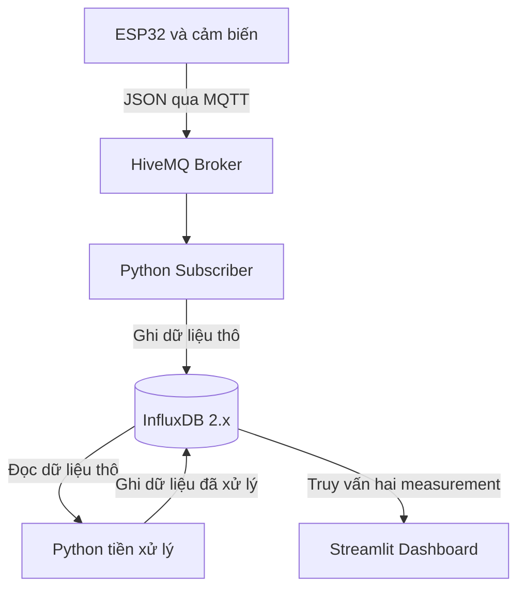

# Bài thực hành số 2 — Thu thập, lưu trữ và tiền xử lý dữ liệu IoT

**Học phần:** IoT và Ứng dụng (INT14149)  
**Sinh viên:** Nguyễn Xuân Bách — B23DCAT024  
**Nhóm lớp:** 15

Hệ thống sử dụng ESP32 trên Wokwi để thu thập nhiệt độ, độ ẩm và khoảng cách; truyền dữ liệu qua MQTT; lưu vào InfluxDB 2.x; tiền xử lý bằng Python và hiển thị bằng Streamlit.

README mô tả bộ mã nguồn hiện có. Các sửa đổi đề xuất trong phần cuối **chưa được áp dụng tự động vào mã nguồn**. Tiền xử lý đang chạy thủ công và dashboard chưa tự làm mới định kỳ.

## 1. Thành phần hệ thống

| Thành phần | Công nghệ | Chức năng |
| --- | --- | --- |
| Thiết bị mô phỏng | ESP32, DHT22, HC-SR04 trên Wokwi | Đọc cảm biến, đóng gói JSON, publish MQTT |
| MQTT Broker | HiveMQ public broker | Chuyển tiếp bản tin từ ESP32 tới Subscriber |
| Subscriber | Python, paho-mqtt, influxdb-client | Nhận JSON, kiểm tra cơ bản và ghi dữ liệu thô |
| Database | InfluxDB 2.x | Lưu dữ liệu chuỗi thời gian |
| Tiền xử lý | pandas, NumPy, scikit-learn | Nội suy, lọc ngoại lệ, tổng hợp theo phút, chuẩn hóa |
| Dashboard | Streamlit | Hiển thị bảng dữ liệu thô và đã xử lý |



## 2. Các tệp mã nguồn

| Tệp được cung cấp | Vai trò |
| --- | --- |
| `sketch(1).ino` | Firmware ESP32 |
| `diagram.json` | Linh kiện và kết nối Wokwi |
| `subcriber(1).py` | Subscribe MQTT và ghi InfluxDB; tên hiện tại là **subcriber** |
| `preprocess(1).py` | Tiền xử lý dữ liệu trong 1 giờ gần nhất |
| `app(1).py` | Dashboard Streamlit |
| `README.md` | Hướng dẫn cài đặt và vận hành |

Các lệnh dưới đây dùng đúng tên tệp có `(1)`. Nếu đổi tên thành `subscriber.py`, `preprocess.py` và `app.py`, hãy sửa tên trong lệnh chạy tương ứng. Khi tạo dự án trên Wokwi, dán nội dung `sketch(1).ino` vào tệp `sketch.ino`.

## 3. Chuẩn bị môi trường

- Máy tính có Python và `pip`; có thể dùng Python 3.11 để tạo môi trường thực hành.
- InfluxDB **2.x** chạy tại `http://localhost:8086`.
- Trình duyệt để chạy Wokwi và mở dashboard.
- Kết nối Internet từ Wokwi và máy chạy Subscriber tới MQTT Broker.
- Không bắt buộc sử dụng Docker.

Phiên bản Python và toàn bộ thư viện của lần thực nghiệm gốc chưa được ghi lại. Sau khi chạy thành công trên máy của mình, lưu phiên bản theo hướng dẫn ở mục 10.

### 3.1. Tạo môi trường Python

Mở terminal tại thư mục chứa các tệp Python.

**Windows PowerShell:**

```powershell
py -3.11 -m venv .venv
.\.venv\Scripts\python.exe -m pip install --upgrade pip
.\.venv\Scripts\python.exe -m pip install "paho-mqtt==1.6.1" influxdb-client pandas numpy scikit-learn streamlit
```

Nếu máy không có Python 3.11 nhưng đã có bản Python phù hợp, thay `py -3.11` bằng lệnh Python đang sử dụng. Gọi trực tiếp Python trong `.venv` giúp không phải thay đổi chính sách chạy script của PowerShell.

**Linux hoặc macOS:**

```bash
python3 -m venv .venv
source .venv/bin/activate
python -m pip install --upgrade pip
python -m pip install "paho-mqtt==1.6.1" influxdb-client pandas numpy scikit-learn streamlit
```

`paho-mqtt==1.6.1` được chọn cho API callback cũ trong mã hiện tại. Nếu dùng Paho 2.x, xem mục xử lý lỗi để điều chỉnh khởi tạo client; không trộn hai hướng cài đặt.

### 3.2. Cấu hình InfluxDB 2.x

1. Cài đặt và khởi động InfluxDB 2.x theo hướng dẫn phù hợp với hệ điều hành: [Tài liệu cài InfluxDB OSS v2](https://docs.influxdata.com/influxdb/v2/install/).
2. Mở `http://localhost:8086` và hoàn thành thiết lập ban đầu nếu đây là lần chạy đầu.
3. Tạo hoặc sử dụng organization `ptit_iot` và bucket `iot_data`.
4. Tạo token có quyền đọc và ghi vào bucket này.
5. Sửa các hằng cấu hình trong **cả ba** tệp `subcriber(1).py`, `preprocess(1).py`, `app(1).py`:

```python
INFLUX_URL = "http://localhost:8086"
INFLUX_TOKEN = "THAY_BANG_TOKEN_CUA_BAN"
INFLUX_ORG = "ptit_iot"
INFLUX_BUCKET = "iot_data"
```

Chuỗi `THAY_BANG_TOKEN_CUA_BAN` chỉ là ký hiệu minh họa, phải thay bằng token của môi trường chạy. Mã hiện tại đọc cấu hình trực tiếp trong tệp, **chưa tự đọc `.env` hoặc biến môi trường**. Không commit token thật lên GitHub; xem mục 10 để chuyển cách cấu hình trước khi công khai mã nguồn.

### 3.3. Cấu hình MQTT

Cấu hình có trong firmware và Subscriber:

| Tham số | Giá trị hiện tại |
| --- | --- |
| Broker | `broker.hivemq.com` |
| Port | `1883` |
| Topic | `lab2/sensors/esp32_01/data` |
| Device ID | `esp32_01` |
| MQTT client ID của ESP32 | `ESP32-Lab2-Client` |
| Wi-Fi mô phỏng | `Wokwi-GUEST`, mật khẩu rỗng |
| Chu kỳ gửi danh định | 5 giây |

Broker công cộng có thể nhận dữ liệu từ nhiều người. Khi nhiều nhóm cùng chạy, nên đổi topic thành một tên riêng, ví dụ `lab2/B23DCAT024/sensors/esp32_01/data`, trong **cả firmware và Subscriber**. Đổi client ID của ESP32 thành tên riêng để tránh trùng kết nối. Nếu đổi device ID, cần sửa cả tag đang gán cứng trong script tiền xử lý.

## 4. Cấu hình ESP32 trên Wokwi

1. Tạo một dự án ESP32 trên [Wokwi](https://wokwi.com/).
2. Chép nội dung firmware vào `sketch.ino` và nội dung sơ đồ vào `diagram.json`.
3. Trong **Library Manager**, thêm `PubSubClient` và thư viện cung cấp `DHTesp.h` (DHT sensor library for ESPx). Wokwi tạo `libraries.txt` khi thêm thư viện; giữ tệp này khi xuất dự án.
4. Kiểm tra kết nối theo bảng dưới đây.
5. Bấm chạy mô phỏng và mở Serial Monitor; firmware sử dụng tốc độ 115200 baud.

| Linh kiện | Chân linh kiện | Chân ESP32 trong sơ đồ |
| --- | --- | --- |
| DHT22 | SDA | GPIO15 |
| DHT22 | VCC / GND | 3V3 / GND |
| HC-SR04 | TRIG | GPIO5 |
| HC-SR04 | ECHO | GPIO18 |
| HC-SR04 | VCC / GND | VIN / GND |
| LED và điện trở | Nhánh điều khiển | GPIO2 |

LED có trong sơ đồ nhưng chưa được firmware điều khiển. Bảng trên mô tả mô phỏng được cung cấp; không phải hướng dẫn đấu nối phần cứng thực tế.

Ví dụ cấu trúc bản tin JSON:

```json
{
  "device_id": "esp32_01",
  "temperature": 24.0,
  "humidity": 40.0,
  "distance_cm": 100.0,
  "rssi": -78,
  "sequence": 1,
  "uptime_s": 5
}
```

Đây là dữ liệu minh họa định dạng. `uptime_s` là số giây từ khi ESP32 khởi động, không phải timestamp UTC. Firmware chỉ gửi khi cả ba giá trị cảm biến đều hữu hạn.

## 5. Chạy hệ thống

Thứ tự thực hiện: khởi động InfluxDB → chạy Subscriber → bật Wokwi → chạy tiền xử lý → mở dashboard.

### 5.1. Chạy Subscriber

Trong terminal thứ nhất trên Windows:

```powershell
.\.venv\Scripts\python.exe "subcriber(1).py"
```

Trên Linux/macOS, sau khi kích hoạt môi trường:

```bash
python "subcriber(1).py"
```

Kết quả mong đợi trong terminal:

- Thông báo đã kết nối MQTT Broker.
- Thông báo đang theo dõi đúng topic.
- Sau khi bật Wokwi, xuất hiện dòng `-> Đã lưu vào database:` kèm dữ liệu.

Giữ terminal này chạy trong suốt quá trình thu thập. Việc firmware in JSON chỉ cho biết nó đã thực hiện nhánh gửi; mã hiện tại chưa kiểm tra giá trị trả về của `publish()`, nên cần đối chiếu log Subscriber và dữ liệu trong database.

### 5.2. Chạy tiền xử lý

Thu dữ liệu trong vài phút. Có thể thay đổi nhiệt độ, độ ẩm và khoảng cách trên mô phỏng để tạo các tình huống thử. Lưu ý lỗi lọc cột hằng ở mục 9 vẫn cần được sửa để xử lý đúng dữ liệu không đổi.

Trong terminal thứ hai trên Windows:

```powershell
.\.venv\Scripts\python.exe "preprocess(1).py"
```

Trên Linux/macOS:

```bash
python "preprocess(1).py"
```

Script chạy một lần rồi kết thúc. Nếu có đầu ra hợp lệ, chương trình thông báo đã lưu vào `environment_processed`. Cần chạy lại thủ công khi muốn xử lý dữ liệu mới; chưa có scheduler.

### 5.3. Mở dashboard

Trong terminal thứ ba trên Windows:

```powershell
.\.venv\Scripts\python.exe -m streamlit run "app(1).py"
```

Trên Linux/macOS:

```bash
python -m streamlit run "app(1).py"
```

Mở URL được Streamlit in trong terminal, thường là `http://localhost:8501`.

Dashboard gồm:

- **Dữ liệu thô:** truy vấn `environment` trong 15 phút gần nhất.
- **Dữ liệu đã tiền xử lý:** truy vấn `environment_processed` trong 1 giờ gần nhất.

Ứng dụng hiện chưa có cơ chế tự làm mới theo lịch. Dùng thao tác **Rerun** của Streamlit hoặc tải lại trang để truy vấn lại. Chạy lại `preprocess(1).py` trước nếu muốn xem kết quả xử lý mới.

### 5.4. Dừng hệ thống

Dừng mô phỏng Wokwi, sau đó nhấn `Ctrl+C` ở các terminal Subscriber và Streamlit. Script tiền xử lý tự kết thúc sau mỗi lần chạy.

## 6. Schema dữ liệu

Cấu hình mặc định: organization `ptit_iot`, bucket `iot_data`.

### Measurement `environment`

| Thành phần | Tên | Kiểu và ý nghĩa |
| --- | --- | --- |
| Tag | `device_id` | Chuỗi định danh thiết bị |
| Field | `temperature` | Float, nhiệt độ °C |
| Field | `humidity` | Float, độ ẩm %RH |
| Field | `distance_cm` | Float, khoảng cách cm |
| Field | `rssi` | Integer, cường độ tín hiệu Wi-Fi |
| Field | `sequence` | Integer, số thứ tự bản tin |
| Thời gian | `_time` | Được InfluxDB gán vì Subscriber chưa đặt thời gian vào Point |

Subscriber chưa lưu `uptime_s`. `sequence` được lưu làm field nhưng mã chưa tự kiểm tra mất gói hoặc loại trùng.

### Measurement `environment_processed`

| Thành phần | Tên | Ý nghĩa |
| --- | --- | --- |
| Tag | `device_id` | Hiện gán cứng `esp32_01` |
| Field | `temperature_clean` | Nhiệt độ trung bình theo phút sau lọc |
| Field | `humidity_clean` | Độ ẩm trung bình theo phút sau lọc |
| Field | `temp_rolling_mean` | Trung bình trượt nhiệt độ trên 3 hàng đã tổng hợp |
| Field | `temp_scaled` | Nhiệt độ được chuẩn hóa bằng StandardScaler |

`hum_scaled` được tính trong DataFrame nhưng chưa được ghi vào database. Khoảng cách sau tổng hợp cũng chưa được lưu. Mốc thời gian đầu ra cần sửa như mô tả tại mục 9.

### Truy vấn kiểm tra bằng Flux

Trong Data Explorer của InfluxDB, chạy:

```flux
from(bucket: "iot_data")
  |> range(start: -15m)
  |> filter(fn: (r) => r["_measurement"] == "environment")
  |> filter(fn: (r) => r["device_id"] == "esp32_01")
  |> pivot(rowKey: ["_time"], columnKey: ["_field"], valueColumn: "_value")
  |> sort(columns: ["_time"])
```

Để xem dữ liệu xử lý, đổi measurement thành `environment_processed` và khoảng truy vấn thành `-1h`.

## 7. Quy trình tiền xử lý

1. Truy vấn dữ liệu thô trong 1 giờ gần nhất và chuyển các field thành cột bằng `pivot`.
2. Ghép danh sách DataFrame bằng `pd.concat()` nếu thư viện trả về nhiều bảng.
3. Đặt `_time` làm index, lấy các cột nhiệt độ, độ ẩm và khoảng cách.
4. Nội suy ô thiếu bằng `interpolate(method="time")`.
5. Tính Z-score, giữ hàng có Z-score tuyệt đối nhỏ hơn 3 ở mọi cột.
6. Tổng hợp trung bình theo cửa sổ 1 phút bằng `resample("1min")`.
7. Tính rolling mean trên 3 hàng; chuẩn hóa nhiệt độ và độ ẩm bằng StandardScaler.
8. Ghi các field được chọn vào `environment_processed`.

StandardScaler thay đổi tâm và thang đo, không bảo đảm biến dữ liệu thành phân phối chuẩn. Nội suy ô thiếu cũng không tự khôi phục bản tin bị mất hoàn toàn nếu chưa tạo hàng tương ứng trên lưới thời gian.

## 8. Kiểm tra và thu thập minh chứng

Các mục sau là **kịch bản kiểm tra**, không phải kết quả đã xác nhận cho mọi môi trường.

| Kịch bản | Cách thực hiện | Minh chứng cần lưu |
| --- | --- | --- |
| Thu thập cơ bản | Bật Subscriber và Wokwi, thay đổi cảm biến | Log nhận/ghi, bảng `environment` |
| Dữ liệu hằng | Giữ cảm biến không đổi rồi chạy tiền xử lý | Số hàng trước/sau; phát hiện lỗi Z-score nếu chưa sửa |
| Dữ liệu biến thiên | Thay đổi các cảm biến trong nhiều phút | Bảng theo từng cửa sổ và rolling mean |
| Giám sát | Mở dashboard, chạy lại tiền xử lý, Rerun | Ảnh hai bảng và thời điểm cập nhật |
| Ngắt kết nối | Tạm dừng Wokwi hoặc Subscriber rồi chạy lại | Khoảng nhảy `sequence`, log lỗi, khả năng kết nối lại |
| Database không sẵn sàng | Tạm dừng InfluxDB trong môi trường thử | Log lỗi ghi và số bản tin không lưu được |

Chưa có cơ chế phát lại dữ liệu đã mất khi database hoặc Subscriber ngừng hoạt động. Khi kiểm tra, ghi rõ ngày giờ, khoảng thời gian chạy và phiên bản thư viện.

**Đo độ trễ:** không lấy `_time` trừ `uptime_s`. Cần bổ sung timestamp UTC tại ESP32, đồng bộ đồng hồ, ghi thời điểm nhận và hoàn tất ghi ở Subscriber rồi ghép theo thiết bị, phiên chạy và sequence. Báo cáo hiện chưa có phép đo end-to-end đã được kiểm chứng.

## 9. Lỗi thường gặp và hạn chế cần sửa

| Hiện tượng | Kiểm tra và hướng xử lý |
| --- | --- |
| Không kết nối được InfluxDB | Kiểm tra dịch vụ đang chạy, URL, port 8086 và đúng phiên bản 2.x |
| Lỗi xác thực InfluxDB | Kiểm tra token, quyền đọc/ghi, organization và bucket trong cả ba script |
| MQTT kết nối nhưng không có dữ liệu | Đối chiếu topic, Internet, Serial Monitor và client ID trùng nhau |
| MQTT `rc=5` | Kiểm tra quyền truy cập và cấu hình xác thực của broker; không tự bỏ xác thực với broker yêu cầu đăng nhập |
| `'list' object has no attribute 'empty'` | Bộ mã đã có nhánh ghép list DataFrame trong app và preprocess; kiểm tra đang chạy đúng tệp |
| Lỗi tần suất `1T` | Dùng `resample("1min")` như mã được cung cấp |
| Dữ liệu rỗng sau lọc ngoại lệ | Kiểm tra cột hằng, thiếu mẫu, NaN và Z-score; kiểm tra rỗng chỉ tránh lỗi tiếp theo, chưa giải quyết nguyên nhân |
| Dashboard chưa có bảng xử lý | Chạy preprocess, xem log và kiểm tra cửa sổ truy vấn; sau đó Rerun dashboard |
| Nhiều hàng xử lý cùng thời điểm ghi | Gắn thời gian cửa sổ vào Point trước khi ghi, như hướng dẫn bên dưới |

### 9.1. Paho MQTT 2.x

Nếu đang dùng Paho 2.x với callback cũ, có thể thay dòng khởi tạo bằng:

```python
mqtt_client = mqtt.Client(mqtt.CallbackAPIVersion.VERSION1)
```

Đây là cách tương thích với callback cũ, đã bị đánh dấu deprecated trong Paho 2.x. Khi nâng cấp lâu dài, chuyển callback sang VERSION2 theo [hướng dẫn migration chính thức](https://eclipse.dev/paho/files/paho.mqtt.python/html/migrations.html). Nếu đã cài 1.6.1 theo mục 3, giữ `mqtt.Client()` như mã gốc.

### 9.2. Thời gian của dữ liệu sau resample

Trong `preprocess(1).py`, thay cách ghi có `time=index` ở lời gọi `write_api.write()` bằng việc gắn timestamp trực tiếp vào Point vừa tạo:

```python
# Đặt ngay sau đoạn tạo p = Point(...).tag(...).field(...)
p.time(index)
write_api.write(bucket=INFLUX_BUCKET, org=INFLUX_ORG, record=p)
```

Sau khi sửa, các điểm mới dùng mốc thời gian cửa sổ tổng hợp. Dữ liệu đã ghi theo cách cũ không tự được sửa; cần phân biệt các lần chạy khi đánh giá kết quả.

### 9.3. Cột hằng và rolling mean

- Trước Z-score, kiểm tra đủ mẫu và dữ liệu hữu hạn. Với cột có độ lệch chuẩn bằng 0, giữ các giá trị hợp lệ của cột đó thay vì chia cho 0 rồi loại hết hàng.
- Sắp xếp index thời gian; khi mở rộng nhiều thiết bị, tiền xử lý riêng từng `device_id`.
- `rolling(window=3).mean().bfill()` có thể còn toàn NaN khi ít hơn 3 hàng và dùng giá trị tương lai để lấp các hàng đầu. Với giám sát chỉ dựa vào quá khứ, cân nhắc:

```python
df_resampled["temp_rolling_mean"] = (
    df_resampled["temperature"].rolling(window=3, min_periods=1).mean()
)
```

- Nếu cần lưu độ ẩm chuẩn hóa hoặc khoảng cách, thêm field tương ứng vào Point; hiện chúng chưa nằm trong schema đầu ra.

### 9.4. Các giới hạn hiện tại

- Chưa có lịch chạy tiền xử lý hoặc tự làm mới dashboard.
- Chưa có hàng đợi bền vững, kiểm tra sequence, loại trùng hoặc thống kê tỷ lệ mất bản tin.
- Kiểm tra đầu vào ở Subscriber mới ở mức cơ bản; JSON lỗi cú pháp bị bỏ qua mà chưa có bộ đếm.
- Chưa có bằng chứng cấu hình retention. Trong InfluxDB 2.x, retention áp dụng theo **bucket**; muốn giữ dữ liệu thô 7 ngày và dữ liệu xử lý 90 ngày thì nên tách bucket và sửa các truy vấn/điểm ghi tương ứng.
- Chưa có số đo tải tối đa và độ trễ end-to-end.

## 10. Chuẩn bị mã nguồn để nộp GitHub

1. Thống nhất tên tệp và cập nhật lệnh chạy trong README nếu đổi tên.
2. Bổ sung `libraries.txt` từ dự án Wokwi.
3. Sau khi kiểm tra hệ thống chạy được, ghi phiên bản thư viện:

   ```powershell
   .\.venv\Scripts\python.exe -m pip freeze > requirements.txt
   ```

   Trên Linux/macOS: `python -m pip freeze > requirements.txt`.

4. Bỏ token thật khỏi mã nguồn trước khi commit. Có thể thay hằng token trong **cả ba tệp Python** bằng:

   ```python
   import os
   INFLUX_TOKEN = os.environ["INFLUX_TOKEN"]
   ```

   Sau khi sửa code, đặt biến ở từng terminal PowerShell dùng để chạy ứng dụng:

   ```powershell
   $env:INFLUX_TOKEN = "TOKEN_CUA_BAN"
   ```

   Trên Linux/macOS: `export INFLUX_TOKEN='TOKEN_CUA_BAN'`. Chỉ tạo `.env` sẽ không có tác dụng nếu chưa bổ sung cơ chế đọc tệp đó. Nếu token thật đã được công khai, thu hồi và tạo token mới.

5. Thêm các mục sau vào `.gitignore`:

   ```gitignore
   .venv/
   __pycache__/
   *.pyc
   .env
   .streamlit/secrets.toml
   ```

6. Đính kèm báo cáo, ảnh minh chứng và liên kết dự án Wokwi. Chỉ ghi kết quả kiểm thử đã thực hiện; không đưa token hoặc thông tin bí mật vào ảnh.

## 11. Tài liệu tham khảo

- Đề Bài thực hành số 2 — Thu thập, lưu trữ và tiền xử lý dữ liệu IoT, học phần INT14149.
- [InfluxDB OSS v2](https://docs.influxdata.com/influxdb/v2/).
- [InfluxDB Python client](https://github.com/influxdata/influxdb-client-python).
- [Cấu hình retention cho bucket](https://docs.influxdata.com/influxdb/v2/admin/buckets/update-bucket/).
- [Paho MQTT Python và thay đổi API callback](https://eclipse.dev/paho/files/paho.mqtt.python/html/migrations.html).
- [Quản lý thư viện trong Wokwi](https://docs.wokwi.com/guides/libraries).
- [StandardScaler](https://scikit-learn.org/stable/modules/generated/sklearn.preprocessing.StandardScaler.html).
